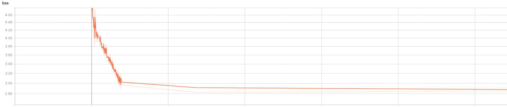
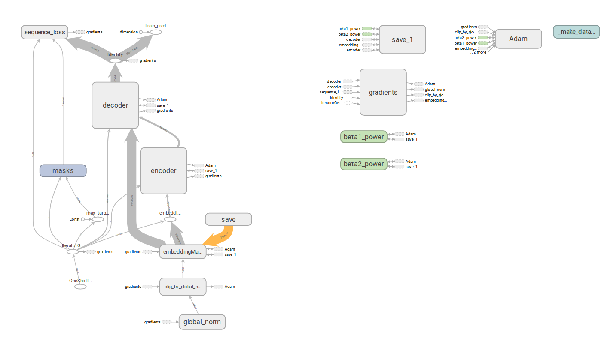
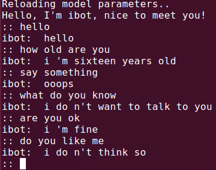

# Readme

This a application of seq2seq to realize a chatbot. 

some detail please find in the original papers and in codes with detailed comments.

#### Loss

#### Graph

#### screenshot

Honestly, this model is fairly simple, and the permformance is not that good, from where I stand, I think,  the performance heavily depends on the quality and size of corpus.